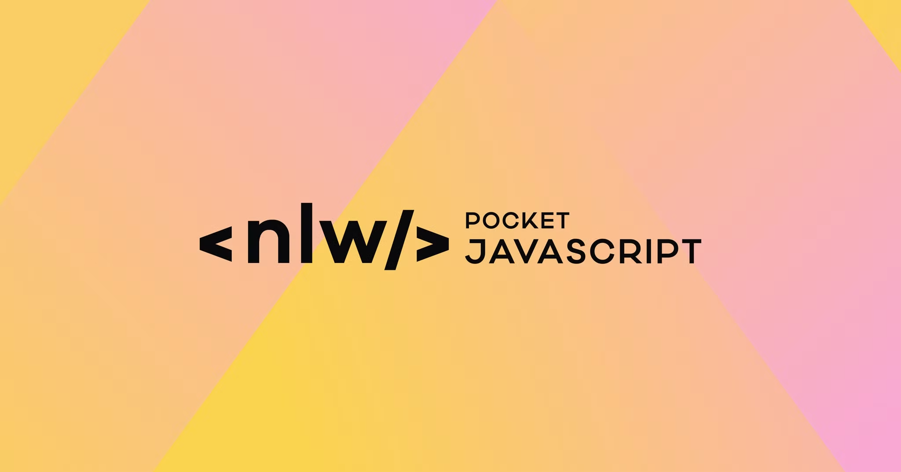

<h1 align="center">NLW Pocket 🚀</h1>

Evento exclusivo e gratuito, promovido pela Rocketseat para ensino de JavaScript.

  <a href="#-tecnologias">Tecnologias</a>&nbsp;&nbsp;&nbsp;|&nbsp;&nbsp;&nbsp;
  <a href="#-projeto">Projeto</a>

  

 

## 🚀 Tecnologias

Esse projeto foi desenvolvido com as seguintes tecnologias:

- Javascript
- Node.js
- Git e Github

## 💻 Projeto

O NLW Pocket é um evento gratuito promovido pela Rocketseat!! 🚀  
Focado no ensino de JavaScript de forma prática e direta. Este repositório contém todo o material desenvolvido durante o evento!

---

Feito com ♥ by Rocketseat

[Participe da nossa comunidade!](https://discord.gg/rocketseat)
